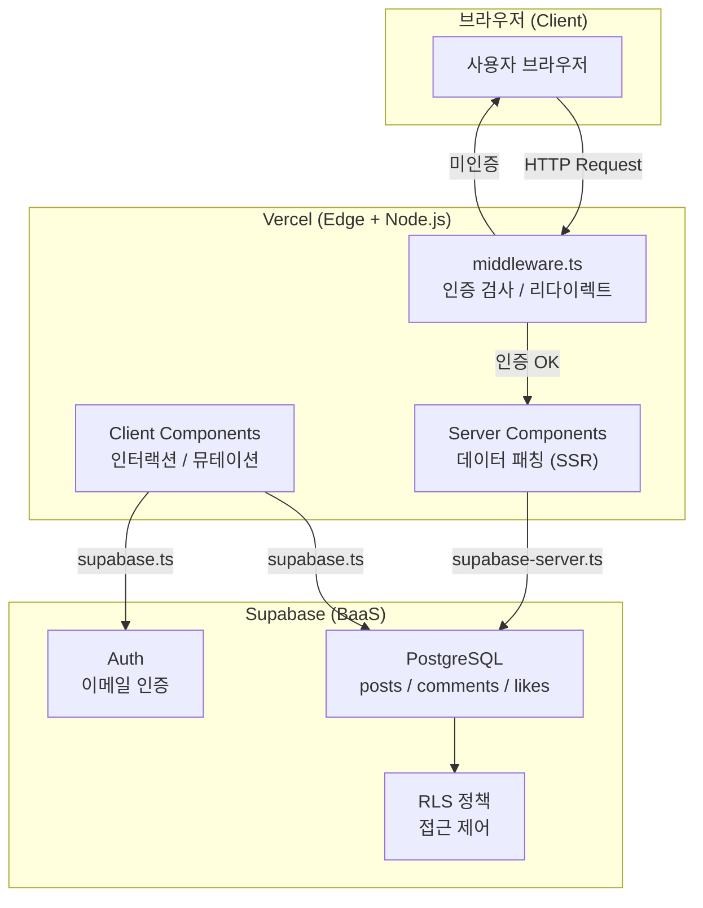
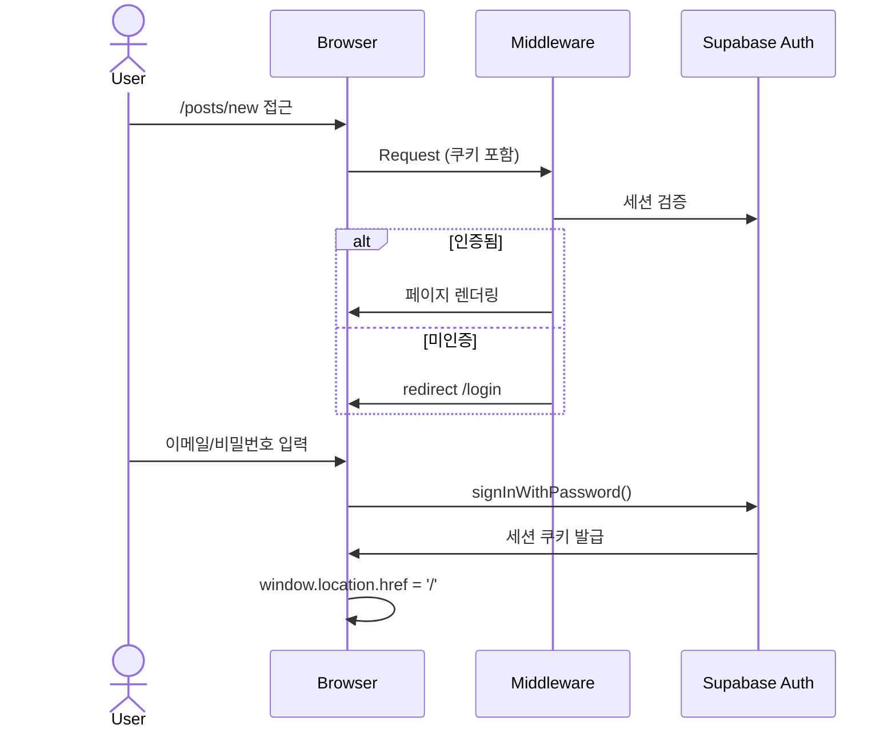

# ARCHITECTURE — 사내 익명 게시판

## 1. 전체 시스템 구조



---

## 2. Next.js App Router 폴더 구조

```
board/src/
├── app/                          # App Router (페이지 단위)
│   ├── layout.tsx                # 루트 레이아웃 (Header, ToastProvider 포함)
│   ├── page.tsx                  # 홈 — 게시글 목록 (Server Component)
│   ├── login/page.tsx            # 로그인 (Client Component)
│   ├── signup/page.tsx           # 회원가입 (Client Component)
│   └── posts/
│       ├── new/page.tsx          # 글쓰기 (Client Component)
│       └── [id]/page.tsx         # 게시글 상세 (Server Component)
│
├── components/                   # 공통 컴포넌트
│   ├── Header.tsx                # 헤더 (Server — 로그인 상태 확인)
│   ├── CategoryFilter.tsx        # 카테고리 탭 (Client)
│   ├── SearchBar.tsx             # 검색창 (Client)
│   ├── TagBadge.tsx              # 태그 뱃지 (Client)
│   ├── TagInput.tsx              # 태그 입력 (Client)
│   ├── LikeButton.tsx            # 좋아요 버튼 (Client)
│   ├── CommentSection.tsx        # 댓글 목록/입력 (Client)
│   ├── DeletePostButton.tsx      # 게시글 삭제 버튼 (Client)
│   ├── ThemeToggle.tsx           # 다크/라이트 토글 (Client)
│   ├── LogoutButton.tsx          # 로그아웃 (Client)
│   └── ToastProvider.tsx         # 토스트 알림 Context (Client)
│
├── lib/
│   ├── supabase.ts               # 클라이언트용 Supabase (Browser)
│   ├── supabase-server.ts        # 서버용 Supabase (SSR cookies)
│   └── search.ts                 # 검색 쿼리 유틸 (parseTags, formatTags)
│
├── types/
│   └── index.ts                  # Post, Comment, Like 타입 정의
│
└── middleware.ts                  # 인증 미들웨어 (Edge Runtime)
```

---

## 3. Server Component vs Client Component

| 구분 | 파일 | 이유 |
|------|------|------|
| **Server** | `app/page.tsx` | DB 데이터 패칭 (SSR), SEO |
| **Server** | `app/posts/[id]/page.tsx` | 게시글 상세 데이터 패칭 |
| **Server** | `components/Header.tsx` | 로그인 상태 서버에서 확인 |
| **Client** | `components/LikeButton.tsx` | 클릭 이벤트, 낙관적 UI |
| **Client** | `components/CommentSection.tsx` | 댓글 작성/삭제 인터랙션 |
| **Client** | `components/SearchBar.tsx` | 입력 상태 관리 |
| **Client** | `app/posts/new/page.tsx` | 폼 입력 상태 관리 |
| **Client** | `components/ToastProvider.tsx` | Context API (전역 상태) |

### Supabase 클라이언트 분리

```
supabase-server.ts   ← Server Component, middleware에서 사용
                       (cookies()로 세션 읽기)

supabase.ts          ← Client Component에서 사용
                       (브라우저 세션 기반)
```

---

## 4. 인증 흐름



**보호 경로:** `/posts/new` — `middleware.ts`에서 세션 없으면 `/login`으로 리다이렉트

---

## 5. 데이터 흐름

### 게시글 목록 조회 (SSR)

```
브라우저 요청
    → app/page.tsx (Server Component)
    → supabase-server.ts
    → Supabase PostgreSQL (RLS: 전체 읽기 허용)
    → HTML 렌더링 → 브라우저
```

### 게시글 작성 (Client Mutation)

```
폼 제출
    → app/posts/new/page.tsx (Client Component)
    → supabase.ts
    → Supabase PostgreSQL (RLS: 로그인 유저만 INSERT)
    → sessionStorage.setItem('pendingToast', ...)
    → window.location.href = '/' (전체 새로고침)
    → app/page.tsx에서 토스트 표시
```

### 좋아요 토글 (낙관적 UI)

```
버튼 클릭
    → LikeButton (Client Component)
    → UI 즉시 업데이트 (낙관적)
    → supabase.ts → INSERT or DELETE
    → 실패 시 UI 롤백
```

---

## 6. DB 스키마

```sql
posts (
  id          uuid PRIMARY KEY,
  user_id     uuid REFERENCES auth.users,  -- UI 노출 금지
  title       text NOT NULL,
  content     text NOT NULL,
  category    text,                         -- 자유/건의/칭찬/고민
  tags        text[],                       -- GIN 인덱스
  created_at  timestamptz DEFAULT now()
)

comments (
  id          uuid PRIMARY KEY,
  post_id     uuid REFERENCES posts,
  user_id     uuid REFERENCES auth.users,  -- UI 노출 금지
  content     text NOT NULL,
  created_at  timestamptz DEFAULT now()
)

likes (
  id          uuid PRIMARY KEY,
  post_id     uuid REFERENCES posts,
  user_id     uuid REFERENCES auth.users,
  created_at  timestamptz DEFAULT now(),
  UNIQUE(post_id, user_id)                 -- 1인 1회 제한
)
```

### RLS 정책

| 테이블 | 읽기 | 쓰기 | 삭제 |
|--------|------|------|------|
| posts | 전체 허용 | 로그인 유저 | 본인만 |
| comments | 전체 허용 | 로그인 유저 | 본인만 |
| likes | 전체 허용 | 로그인 유저 | 본인만 |

---

## 7. 토스트 알림 아키텍처

페이지 전환(`window.location.href`) 시 상태가 초기화되는 문제를 `sessionStorage`로 해결:

```
글 작성/삭제
    → sessionStorage.setItem('pendingToast', JSON.stringify({message, type}))
    → window.location.href = '/'
    → ToastProvider (layout.tsx에 마운트)
    → useEffect: sessionStorage 확인 → 토스트 표시 → sessionStorage 삭제

댓글 등록/삭제
    → useToast() 훅으로 직접 표시 (같은 페이지)
```

---

## 8. 테스트 구조

```
board/
├── src/__tests__/              # Vitest 테스트 (단위 + 통합)
│   ├── SearchBar.test.tsx       # 단위 — 5개 케이스
│   ├── TagInput.test.tsx        # 단위 — 7개 케이스
│   ├── TagBadge.test.tsx        # 단위 — 4개 케이스
│   ├── search.test.ts           # 단위 — 9개 케이스 (유틸)
│   ├── ToastProvider.test.tsx   # 통합 — 4개 케이스 (Context+Hook+sessionStorage)
│   ├── LikeButton.test.tsx      # 단위(Supabase mock) — 4개 케이스
│   └── CommentSection.test.tsx  # 단위(Supabase mock) — 5개 케이스
│
└── e2e/                    # Playwright E2E 테스트
    ├── helpers/auth.ts      # 공통 로그인 헬퍼
    ├── auth.spec.ts         # 인증 흐름 (3개)
    ├── post.spec.ts         # 게시글 CRUD (2개)
    ├── search.spec.ts       # 검색 (3개)
    ├── tag.spec.ts          # 태그 필터 (1개)
    ├── comment.spec.ts      # 댓글 (1개)
    └── like.spec.ts         # 좋아요 (1개)
```

| 테스트 종류 | 도구 | 결과 |
|------------|------|------|
| 단위 테스트 | Vitest + React Testing Library | 25/25 통과 |
| 통합 테스트 | Vitest + React Testing Library | 4/4 통과 (ToastProvider) |
| 단위 테스트 (Supabase mock) | Vitest + React Testing Library | 9/9 통과 (LikeButton, CommentSection) |
| E2E — Desktop Chrome | Playwright | 11/11 통과 |
| E2E — Mobile Chrome (Pixel 5) | Playwright | 11/11 통과 |
| 커버리지 | @vitest/coverage-v8 | 대상 컴포넌트 100% |
